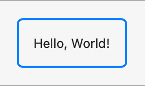
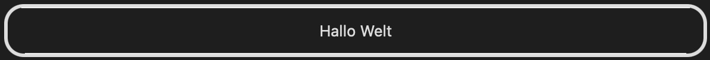
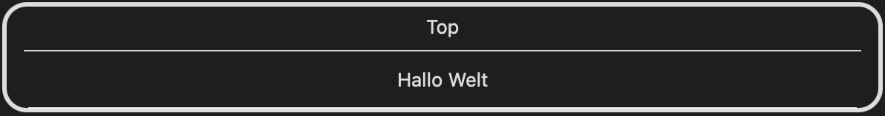
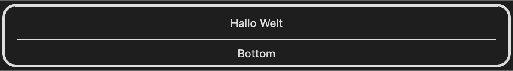

# SUEFrames

SwiftUI Views modifiers to add frames

<p align="center">
<a href="LICENSE.md">
    
</a>
<a href="https://swift.org">
    
</a>

SUE stands for *S*wift*U*I *E*xtras and is a collection of small SwiftUI libraries for various recurring use cases

## Gallery

### addRectangleFrame
```swift
Text("Hello, World!").padding().addRectangleFrame().padding()
```


### addFrame
```swift
Text("Hallo Welt").padding(10).addFrame()
```


```swift
Text("Hallo Welt").padding(10).addFrame(topToolbar: Text("Top"))
```


```swift
Text("Hallo Welt").padding(10).addFrame(bottomToolbar: Text("Bottom"))
```



## License

MIT license; see [LICENSE](LICENSE.md).
(c) 2020
